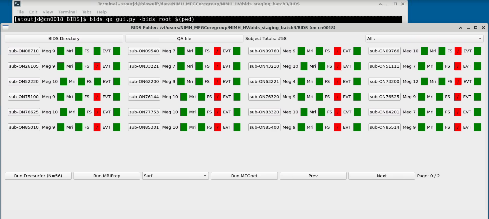
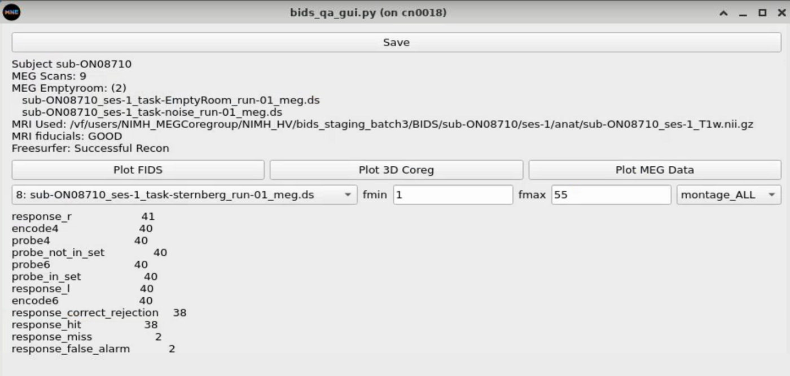
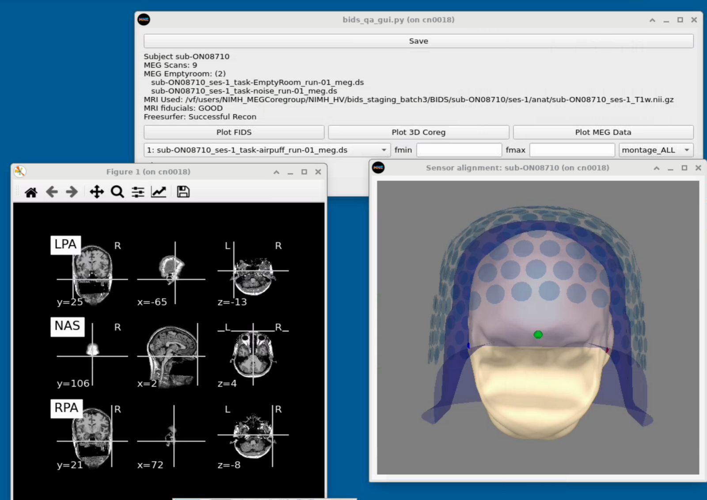

[](https://github.com/nih-megcore/nih_to_mne/actions/workflows/nih2mne-actions.yml)

## Major Components
```
  calc_mnetrans.py - extract the transformation matrix (used under the hood in other processes)
  make_meg_bids.py - perform the whole bids conversion of the CTF folder
  make_bid_fs_swarm.sh - On biowulf create the swarm file for the freesurfer processing
  megcore_prep_mri_bids.py - perform all of the standard MRI processing for datasets
  eyetracking_preprocessing.py - identify eyetracking position from UADC channels
  print_bids_table.py - make a csv file that lists all the contents of your bids tree
```

## Install:
Set up MNE environment (conda can be substituted for mamba below if it doesn't work):<br>
```mamba create --override-channels --channel=conda-forge --name=mne15 'mne=1.5' 'numba<0.60' 'python<3.12'``` <br>
```mamba activate mne15```<br>
Install nih_to_mne<br>
```pip install git+https://github.com/nih-megcore/nih_to_mne```

## GUI Components For Creating and QA-ing BIDS data
Overview Here: https://megcore.nih.gov/index.php/BIDS_GUIs
Include: Trigger Parsing, BIDS creation, and BIDS QA






## Adds calc_mnetrans.py, bstags.py, and make_meg_bids.py to the commandline

### calc_mnetrans.py
```
usage: calc_mnetrans.py [-h] [-subjects_dir SUBJECTS_DIR] [-anat_json ANAT_JSON] [-tagfile TAGFILE]
                        [-elec_txt ELEC_TXT] -subject SUBJECT [-afni_mri AFNI_MRI]
                        [-trans_output TRANS_OUTPUT] -dsname DSNAME [-view_coreg]

optional arguments:
  -h, --help            show this help message and exit
  -subjects_dir SUBJECTS_DIR
                        Set SUBJECTS_DIR different from the environment variable. If not set this
                        defaults to os.environ['SUBJECTS_DIR]
  -anat_json ANAT_JSON  Full path to the BIDS anatomy json file with the NAS,RPA,LPA locations
  -tagfile TAGFILE      Tagfile generated by bstags.py
  -elec_txt ELEC_TXT    Electrode text file exported from brainsight
  -subject SUBJECT      The freesurfer subject id. This folder is expected to be in the freesurfer
                        SUBJECTS_DIR
  -afni_mri AFNI_MRI    Provide a BRIK or HEAD file as input. Data must have the tags assigned to
                        the header.
  -trans_output TRANS_OUTPUT
                        The output path for the mne trans.fif file
  -dsname DSNAME        CTF dataset to create the transform
  -view_coreg           Display the coregistration of MEG and head surface
```

### bstags.py
```
usage: bstags.py file.txt
          Where file.txt is the saved electrode location output from Brainsight.
```

### make_meg_bids.py
```
usage: 
        Convert MEG dataset to default Bids format using the MEG hash ID or 
        entered subject ID as the bids ID.        
        

WARNING: Must use the -anonymize flag to anonymize otherwise this does NOT anonymize the data!!!
        
       [-h] [-bids_dir BIDS_DIR] -meg_input_dir MEG_INPUT_DIR [-anonymize] [-mri_brik MRI_BRIK]
       [-mri_bsight MRI_BSIGHT] [-mri_bsight_elec MRI_BSIGHT_ELEC] [-bids_session BIDS_SESSION]
       [-subjid SUBJID] [-autocrop_zeros]

options:
  -h, --help            show this help message and exit
  -bids_dir BIDS_DIR    Output bids_dir path
  -meg_input_dir MEG_INPUT_DIR
                        Acquisition directory - typically designated by the acquisition date
  -anonymize            Strip out subject ID information from the MEG data. Currently this does not
                        anonymize the MRI. Requires the CTF tools.
  -bids_session BIDS_SESSION
                        Data acquisition session. This is set to 1 by default. If the same subject had
                        multiple sessions this must be set manually
  -subjid_input SUBJID_INPUT
                        The default subject ID is given by the MEG hash. If more than one subject is
                        present in a folder, this option can be set to select a single subjects
                        dataset.
  -bids_id BIDS_ID      The default subject ID is given by the MEG hash. To override the default
                        subject ID, use this flag. If -anonymize is used, you must set the subjid
  -autocrop_zeros       If files are terminated early, leaving zeros at the end of the file - this
                        will detect and remove the trailing zeros

Afni Coreg:
  -mri_brik MRI_BRIK    Afni coregistered MRI

Brainsight Coreg:
  -mri_bsight MRI_BSIGHT
                        Brainsight mri. This should be a .nii file. The exported electrodes text file
                        must be in the same folder and end in .txt. Otherwise, provide the
                        mri_sight_elec flag
  -mri_bsight_elec MRI_BSIGHT_ELEC
                        Exported electrodes file from brainsight. This has the locations of the
                        fiducials

Additional Options:
  -freesurfer           Perform recon-all pipeline on the T1w. This is required for the mri_prep
                        portions below
  -project PROJECT      Output project name for the mri processing from mri_prep


```
### make_bid_fs_swarm.sh
From the bids folder - will create derivatives folder for freesurfer/subjects; write out the swarm file; and submit to swarm (with confirmation)
```
make_bids_fs_swarm.sh    #Must be in the bids folder
```


### print_bids_table.py
Print out information on the created bids dataset, including the number of acq runs per subject with task column headers
```
usage: print_bids_table.py [-h] [-bids_dir BIDS_DIR] [-session SESSION]
                           [-output_fname OUTPUT_FNAME] [-print_task_counts]

options:
  -h, --help            show this help message and exit
  -bids_dir BIDS_DIR    Location of the bids directory
  -session SESSION      Session of data acq
  -output_fname OUTPUT_FNAME
                        If set the value counts of all the tasks will be written to a csv
                        table. This has more information than the print_task_counts
  -print_task_counts    Print out the number of task runs and number of subjects in the
                        bids dataset
```
